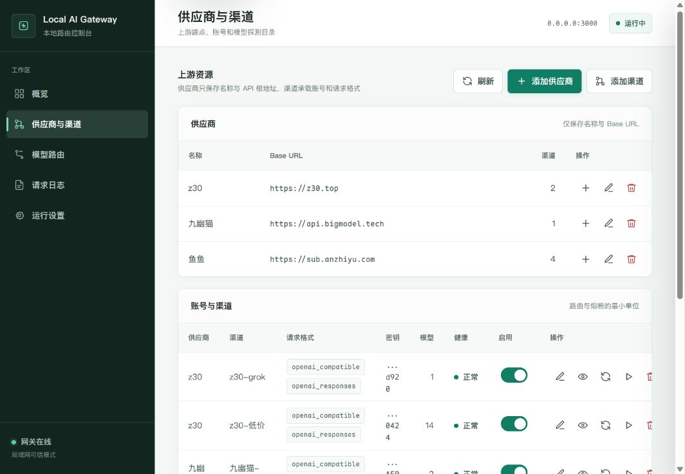
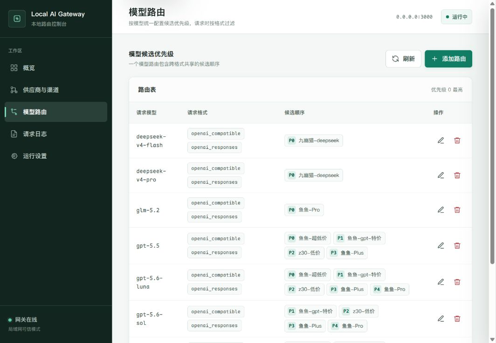
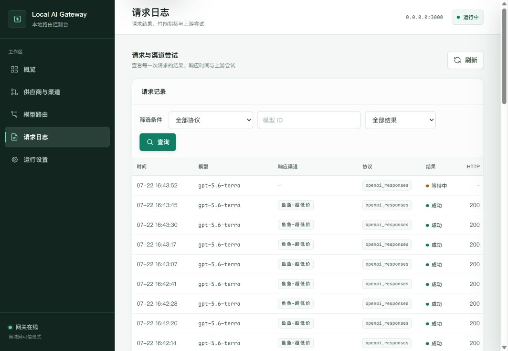

# Local AI Gateway

面向个人本地环境的多供应商 AI 透明网关。后端使用 Python，管理端使用原生 HTML、CSS 和 JavaScript，提供同协议渠道故障转移、模型自动探测、渠道熔断恢复和请求用量统计。

## 当前能力

- OpenAI Compatible、OpenAI Responses、Claude、Gemini 四个独立协议池；同一渠道可启用多个协议。
- 按模型 ID 合并路由，渠道优先级只配置一次，请求时按入口协议过滤后进行同协议故障转移。
- 请求、成功响应和最终上游 HTTP 错误保持原始字节不变。
- 连续错误自动熔断 15 分钟，到期后以最小 `OK` 请求探测并静默恢复。
- 旁路统计首字节、首 Token、TPS、缓存读取/写入/未命中和输出 Token。
- Claude 模型映射助手：对外暴露 Claude Code 标准模型名（如 `claude-opus-5`），控制台按模型独立配置上游协议与候选渠道，请求时自动完成协议转换（参考 CLIProxyAPI 的转换思路），路由实时生效。
- Codex 模型映射助手：对外暴露 Codex 标准模型名（如 `gpt-5-codex`），与 Claude 映射同一套转换体系，让 Codex CLI 通过独立入口 `/codex` 使用任意上游模型。
- 模型能力档案：内置 `capability_profiles` 表收集可复用的模型能力集合，支持手动创建/编辑/删除；在「模型路由 → 配置能力」中可直接选择档案应用（多个模型可共用同一套能力，如 GPT-5.6 Sol/Terra/Luna），修改档案自动同步到所有引用模型；成本仍按模型独立配置。
- 原生管理端覆盖供应商、渠道、模型探测、路由、能力档案、Claude 映射、Codex 映射、日志、健康状态和运行设置，无需 Node.js 或前端构建步骤。

## 使用说明

- 首先添加供应商，包含名字和baseurl两个字段。
- 然后添加渠道，选择对应的供应商后填入apikey，即可完成渠道创建。
- 创建渠道后可以手动进行模型探测，会自动从上游探测可用模型。
- 必须在路由中配置模型以及路由规则，才能在v1/models端点检索到模型，并通过对应端点调用。
- 模型能力（上下文、最大输出、图像/思考支持、成本）可在「模型路由 → 配置能力」中手动配置；内置「能力档案」页可创建可复用的能力集合，在配置能力抽屉中选择档案即可一键应用并建立关联（如 GPT-5.6 Sol/Terra/Luna 共用一套），也可直接点「保存为档案」把当前表单存为新档案，修改档案会同步到所有引用它的模型。
- 本项目模型路由只对请求进行简单转发，不进行任何额外处理，因此在配置渠道端点时务必确保上游支持所选端点。
- Claude 模型映射助手（Claude Code 标准名 → 系统中已配置的模型，独立于常规请求）：
  1. 先在供应商与渠道页配置好上游渠道并探测/登记模型，再到「模型路由」页为上游模型配置候选优先级（候选渠道直接在系统中已配置的模型里选择，映射无需单独配置候选）。
  2. 打开「Claude 映射」页，点击「添加映射」：可从预设下拉快速选择 Anthropic 当前模型名（如 `claude-opus-5`，内置默认 + 经已配置的 Claude 渠道实时刷新），再从「上游模型」下拉选择——数据源直接来自「模型路由」页已配置路由的模型，并按所选上游协议自动过滤；再选择该模型独立使用的上游协议（OpenAI Chat / OpenAI Responses / Claude 原生 / Gemini）。
  3. 保存后立即生效。候选渠道自动继承上游模型在「模型路由」中的配置，修改路由实时生效，无需单独设置映射候选。
  4. 映射仅通过独立入口 `/claudecode` 提供服务，不影响其他应用调用常规 `/v1/*` 端点：
     - `GET /claudecode`：接入信息（端点清单与配置提示）
     - `GET /claudecode/v1/models`、`GET /claudecode/v1/messages/models`：Claude Code 探测模型目录（Claude 格式）
     - `POST /claudecode/v1/messages`：模型请求入口，自动转换请求为上游协议、转发并故障转移，再把响应转换回 Claude 格式（流式响应逐事件转换）
  5. Claude Code 接入：设置 `ANTHROPIC_BASE_URL=http://<网关地址>:3000/claudecode`，`ANTHROPIC_API_KEY` 任意值，`ANTHROPIC_MODEL` 填映射名（如 `claude-opus-5`）。
- Codex 模型映射助手（Codex 标准名 → 系统中已配置的模型，独立于常规请求）：
  1. 配置方式与 Claude 映射相同：先在供应商与渠道页配置好上游渠道并探测/登记模型，再到「模型路由」页为上游模型配置候选优先级，然后打开「Codex 映射」页添加映射（预设下拉含 `gpt-5-codex` 等 Codex 标准模型名，内置默认 + 经已配置的 OpenAI Responses 渠道实时刷新；上游模型与上游协议选择同 Claude 映射）。
  2. 保存后立即生效。候选渠道自动继承上游模型在「模型路由」中的配置，修改路由实时生效，无需单独设置映射候选。
  3. 映射仅通过独立入口 `/codex` 提供服务，不影响其他应用调用常规 `/v1/*` 端点：
     - `GET /codex`：接入信息（端点清单与配置提示）
     - `GET /codex/v1/models`、`GET /codex/v1/responses/models`：Codex 探测模型目录（OpenAI 格式）
     - `POST /codex/v1/responses`：模型请求入口，自动转换请求为上游协议、转发并故障转移，再把响应转换回 OpenAI Responses 格式（流式响应逐事件转换）
  4. Codex CLI 接入：在 `~/.codex/config.toml` 中设置（Codex 会向 base URL 追加 `/responses` 与 `/models`，因此必须带 `/v1` 前缀）：
     ```toml
     openai_base_url = "http://<网关地址>:3000/codex/v1"
     model = "gpt-5-codex" # 映射名，如 gpt-5-codex
     ```
     并设置任意值的 `OPENAI_API_KEY`。也可以改用自定义 provider（可同时关闭 WebSocket 探测，避免先连 WS 失败再回退 HTTP）：
     ```toml
     model = "gpt-5-codex"
     model_provider = "gateway"

     [model_providers.gateway]
     name = "Local AI Gateway"
     base_url = "http://<网关地址>:3000/codex/v1"
     env_key = "LOCAL_GATEWAY_KEY"
     supports_websockets = false
     ```

### 控制台操作示意

#### 1. 添加供应商与渠道

供应商保存名称和 Base URL；在其下创建渠道后，选择上游支持的请求格式并填入 API Key。密钥在列表中仅显示脱敏提示。



#### 2. 为模型配置路由优先级

将已探测到的模型加入路由，并按渠道设置候选顺序。优先级 `0` 最高，请求会在相同协议的可用候选中按此顺序尝试。



#### 3. 查看请求结果与实际响应渠道

请求日志记录协议、响应渠道、结果、HTTP 状态、尝试次数和耗时。每个响应渠道独立显示，便于区分多次路由。



## 快速启动

需要 Python 3.12+ 和 [uv](https://docs.astral.sh/uv/)。

```bash
make install
cp backend/.env.example backend/.env
```

编辑 `backend/.env` 后运行：

```bash
make run
```

打开 [http://127.0.0.1:3000](http://127.0.0.1:3000)，信任局域网模式默认无需输入管理密钥。关闭信任后再使用设置页中的手动或随机密钥。首次配置顺序为：

1. 新建供应商并填写不带 `/v1` 或 `/v1beta` 的 API 根地址。
2. 在供应商下新建渠道，选择一个或多个请求格式并填写 API Key。
3. 执行模型探测。
4. 创建模型路由并为候选渠道设置唯一优先级。

默认监听 `0.0.0.0:3000` 并信任局域网访问，因此管理端和代理入口不要求本地访问密钥。关闭“信任局域网访问”后，可以在设置页手动填写或随机生成管理密钥与代理密钥。上游 API Key 使用本地主密钥加密后写入 SQLite，管理 API 不回显明文。

## 调用示例

OpenAI Compatible：

```bash
curl http://127.0.0.1:3000/v1/chat/completions \
  -H "Content-Type: application/json" \
  -d '{"model":"YOUR_MODEL_ID","messages":[{"role":"user","content":"Hello"}]}'
```

其他协议使用各自原生路径。关闭局域网信任后，可使用各协议原生认证位置或统一的 `X-Local-Gateway-Key` 提供代理密钥。

客户端模型目录端点：

- 通用聚合目录：`GET /v1/models`，仅返回已配置且存在可用候选的模型，`x_local_gateway` 仅列出 `supported_endpoints`。
- OpenAI Compatible：`GET /v1/models?protocol=openai_compatible`
- OpenAI Responses：`GET /v1/models?protocol=openai_responses`；兼容别名为 `GET /v1/responses/models`
- Claude：携带 `anthropic-version` 请求 `GET /v1/models`；兼容别名为 `GET /v1/messages/models`
- Gemini：`GET /v1beta/models`

聚合目录保持 OpenAI 标准的 `object: "list"` 和 `data[].id` 结构，额外字段可被 CC Switch 等只读取标准字段的客户端忽略。`GET /v1/models` 也接受 `X-Local-Gateway-Protocol` 显式选择单个协议池。

## 桌面打包

桌面端基于 Tauri 2。先安装 Rust 与 Tauri CLI：

```bash
cargo install --locked tauri-cli --version '^2'
```

在 Arch Linux 上可按目标单独打包，也可一次完成全部目标：

```bash
make package-appimage       # 本机 .deb + AppImage
make package-arch           # Arch .pkg.tar.zst
make package-windows-wine   # MinGW 交叉编译 + Wine 生成 NSIS 安装包
make package-all            # 依次执行以上全部流程
```

Arch 包需要 `makepkg`、GTK/WebKitGTK 与 Ayatana AppIndicator 开发环境；Windows 交叉构建需要 Wine、MinGW-w64、Rustup 和 `unzip`，脚本会自动安装 Rust Windows GNU target 并缓存便携版 NSIS。所有目标的产物会自动复制到仓库根目录的 `releases/` 文件夹（原始构建输出仍在各自的 target 目录）。发布标签也会通过 `.github/workflows/desktop.yml` 构建相同平台矩阵。

## 开发与验证

```bash
make test
```

后端测试使用 mock 上游验证字节一致性、四协议入口、同协议隔离、故障转移、熔断和流式响应边界，不需要真实供应商密钥。

## systemd 部署

仓库提供 [服务模板](deploy/local-ai-gateway.service.example)。复制到 `/etc/systemd/system/local-ai-gateway.service` 后，替换 `YOUR_USER`、`YOUR_GROUP` 和 `/opt/local-ai-gateway` 为实际安装路径，再执行：

```bash
sudo systemctl daemon-reload
sudo systemctl enable --now local-ai-gateway
```

运行数据库、主密钥、`.env` 和本机专用服务文件均被 Git 忽略，不会上传到远端。

## 设计文档

- [需求基线](docs/requirements.md)
- [总体架构](docs/architecture.md)
- [API 设计](docs/api-design.md)
- [数据模型](docs/data-model.md)
- [实现计划](docs/implementation-plan.md)

## 核心边界

- 支持 OpenAI Compatible、OpenAI Responses、Claude、Gemini 四种协议。
- 模型路由功能只在完全相同的协议内进行故障转移，不做跨协议转换。
- 用户请求体、上游响应体和最终上游 HTTP 错误保持原始字节不变。
- 网关只处理路由、认证替换、逐跳头处理、故障转移、旁路统计和健康检查。
- 不进行价格或费用计算。

详细架构与验收边界见上述设计文档。
