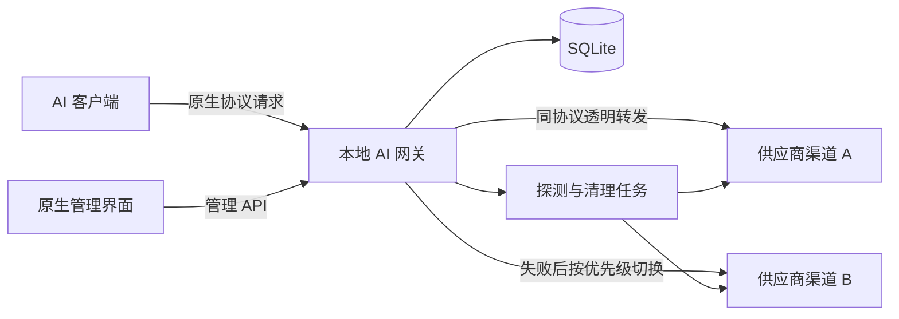
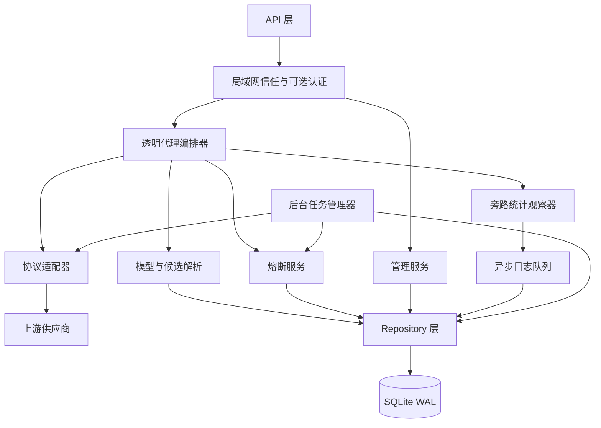
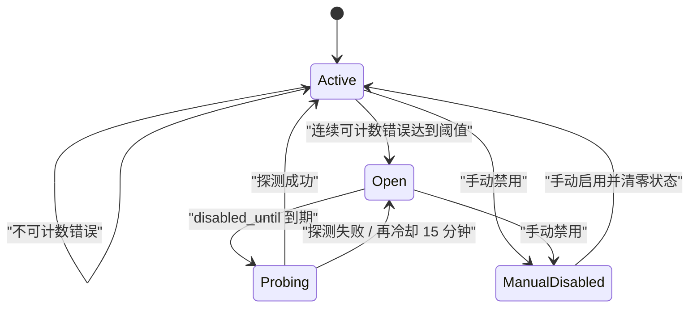
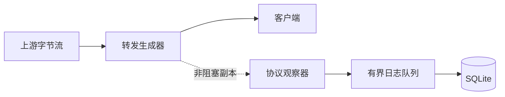

# 总体架构

状态：设计基线  
更新日期：2026-07-22

## 1. 架构目标

架构围绕三个约束设计：

1. 代理热路径保持简单，原始请求和响应字节不经过业务重编码。
2. 故障转移严格限制在相同协议和相同模型 ID 内。
3. 路由、熔断、探测和统计可以独立演进，任何旁路能力失败都不影响代理返回。

## 2. 技术选型

### 2.1 后端

| 领域 | 选型 | 用途 |
| --- | --- | --- |
| 运行时 | Python 3.12+ | 后端运行环境 |
| Web 框架 | FastAPI + Starlette | 管理 API、代理路由、流式响应 |
| ASGI 服务器 | Uvicorn | 本地单进程服务 |
| HTTP 客户端 | HTTPX AsyncClient | 连接池、异步流式上游请求 |
| ORM 与迁移 | SQLAlchemy 2.x + Alembic | SQLite 数据访问与版本迁移 |
| SQLite 驱动 | aiosqlite | 异步持久化 |
| 配置 | pydantic-settings | 环境变量和本地配置 |
| 密钥保护 | cryptography | API Key 静态加密 |
| 测试 | pytest、pytest-asyncio、respx | 单元与代理集成测试 |

首版不引入 Redis、Celery 或外部消息队列。后台任务由进程内异步任务管理器执行，因此生产运行固定为一个 Uvicorn worker。

### 2.2 前端

| 领域 | 选型 |
| --- | --- |
| 页面结构 | 原生 HTML |
| 样式 | 原生 CSS 自定义令牌与响应式布局 |
| 交互 | 浏览器原生 ES Module JavaScript |
| 路由 | History API 与 FastAPI 静态回退 |
| 表单与对话框 | 原生表单、`dialog` 和可访问性属性 |
| 静态托管 | FastAPI `StaticFiles` 挂载 `frontend/public` |
| 构建依赖 | 无，不需要 Node.js、包管理器或打包步骤 |

管理界面定位为本地运维工具，采用紧凑的信息布局，不建设营销页面。静态文件直接由 FastAPI 托管，形成一个 Python 进程和一个访问地址。

## 3. 系统上下文



## 4. 后端分层



### 4.1 API 层

- 按 URL 明确识别协议，不根据请求正文猜测协议。
- 按运行时设置决定直接信任访问，或校验管理/代理访问密钥。
- 将请求交给透明代理编排器或管理服务。
- 统一处理只由网关自身产生的 `400/401/404/409/502/504`。

### 4.2 透明代理编排器

- 保存可重放的原始请求体。
- 只读提取模型 ID 和流式标志。
- 获取同协议候选快照并按优先级顺序尝试。
- 在首个下游字节发出前决定是否故障转移。
- 管理上游请求取消和资源释放。
- 把传输事件发送给熔断服务和统计观察器。

### 4.3 协议适配器

四种适配器实现同一接口，但不负责协议互转：

```text
ProtocolAdapter
  build_upstream_url(base_url, inbound_path, query)
  inject_credentials(headers, query, api_key)
  extract_model(raw_body, path)
  detect_streaming(raw_body, query)
  discover_models(base_url, api_key)
  build_health_probe(model_id)
  observe_stream_chunk(chunk, observer_state)
  normalize_usage(raw_usage)
```

适配器可以解析一份请求或响应副本来获取路由和统计信息，但发送给上游或客户端的仍是原始字节。解析异常只会使对应统计字段为 `null`，不会中断成功响应。

### 4.4 路由服务

路由键为：

```text
(protocol, requested_model_id)
```

候选选择条件：

```text
channel.manual_enabled = true
AND channel.health_state = active
AND candidate.enabled = true
AND channel_model.available = true
```

候选列表在请求开始时一次性读取并排序。请求过程中配置变化不改变当前快照，避免顺序不稳定。数据库通过唯一约束保证同一路由中不存在相同优先级。

### 4.5 熔断服务

渠道健康状态机：



实现要求：

- 更新连续失败计数时使用数据库事务，防止并发请求丢失更新。
- `open -> probing` 使用条件更新抢占探测权，只允许一个任务成功。
- 探测使用协议适配器构造最小请求，提示模型仅回复 `OK`，并限制最大输出 Token。
- 探测成功的判定为 HTTP `2xx` 且适配器能解析到非空输出；`OK` 文本用于降低成本，不强制模型逐字完全匹配。
- 手动禁用是独立字段，后台任务不得自动覆盖。

### 4.6 模型发现服务

- 使用渠道自己的 API Key 请求模型列表。
- 协议适配器负责 URL、认证和分页差异。
- 将返回结果标准化为 `model_id`、`display_name`、`metadata_json`。
- 同步时只更新目录状态，不自动创建或重新排序路由候选。
- 手动模型记录设置 `source=manual`，自动探测不得删除。

### 4.7 统计观察器

统计观察器通过 tee 方式接收已转发字节的副本：



- 转发生成器优先把字节交给客户端。
- 观察器只维护增量解析状态，不保存完整成功响应；若响应带有 `Content-Encoding`，独立解码旁路副本后再解析 usage，原始响应流不变。
- 旁路解码支持 `gzip`、`deflate`、Brotli 和 Zstandard，解码或解析失败只会让统计字段保持 `null`。
- 日志队列有固定容量；队列满时记录内部丢弃计数，不阻塞代理。
- 请求结束后提交归一化指标和上游原始 usage JSON。
- SSE 或 JSON 解析失败时保留传输耗时和状态码，Token 字段写 `null`。

## 5. 代理请求生命周期

### 5.1 请求准备

1. API 层应用局域网信任策略并确定协议；默认信任模式不要求凭据。
2. 请求体写入 `SpooledTemporaryFile`；小请求保存在内存，超过阈值后自动落临时文件。
3. 适配器从同一份原始字节只读提取模型 ID，不重编码请求。
4. 路由服务生成候选快照，限制到本次最大尝试次数。
5. 没有可用路由时返回网关生成的 `404`；存在路由但渠道全部熔断时返回 `503` 并携带最早恢复时间。

请求体最大尺寸作为可配置安全上限，默认 256 MiB。超过上限时返回网关生成的 `413`。临时文件在请求结束或取消时立即关闭。

### 5.2 单渠道尝试

1. 将请求体游标复位到开头。
2. 复制端到端请求头，移除逐跳头和本地认证。
3. 注入渠道 API Key，构造上游 URL。
4. 使用共享的 HTTPX 连接池发起请求，禁用自动重定向。
5. 收到 `2xx` 后立即准备向客户端转发状态、端到端响应头和原始响应流。
6. 收到非 `2xx` 时，在决定切换前完整读取错误响应到可重放临时存储。
7. 把本次结果提交给熔断服务并写入尝试日志。

### 5.3 最终响应

- 成功响应：原始流直接输出。输出开始后上游中断只终止当前流，不再尝试其他渠道。
- 最终 HTTP 错误：返回保留的原始状态、端到端响应头和原始响应体。
- 最终传输错误：如果之前保存过上游 HTTP 错误，返回最近一次上游 HTTP 错误；否则按超时类型生成 `502` 或 `504`。
- 客户端取消：取消当前 HTTPX 请求并结束，不发起后续尝试。

## 6. 访问控制设计

### 6.1 局域网信任与本地代理认证

默认开启“信任局域网访问”，代理入口和管理 API 都不要求凭据。此时客户端不传 API Key 或传入任意值都不会被本地网关拦截；协议适配器仍会在转发上游前替换为所选渠道的上游 API Key。

关闭信任后，代理入口启用独立的网关访问密钥。为兼容现有 SDK，代理入口从各协议原生认证位置读取本地密钥：

| 协议 | 客户端提供位置 | 转发上游时 |
| --- | --- | --- |
| OpenAI Compatible / Responses | `Authorization: Bearer ...` | 替换为渠道 API Key |
| Claude | `x-api-key` | 替换为渠道 API Key |
| Gemini | `x-goog-api-key` 或 `key` 查询参数 | 删除本地值并注入渠道凭据 |

也支持统一的 `X-Local-Gateway-Key`，便于调试。关闭信任后，管理 API 使用独立的 `Authorization: Bearer <admin_token>`。两类密钥可以手动设置或随机生成，加密保存且只在生成时返回一次。

### 6.2 上游密钥存储

- 首次启动生成随机主密钥文件，权限设置为 `0600`。
- SQLite 只保存加密后的 API Key 密文。
- 管理 API 的读取响应只返回 `has_api_key` 和末尾掩码，不返回密文或明文。
- 更新渠道时，未提供新的 API Key 表示保留原值；显式清除需要单独动作。
- 日志和异常格式化器统一对认证头、`key` 参数和已知密钥值脱敏。

## 7. 并发与一致性

- HTTPX 按供应商源站复用连接，限制每源站最大连接数和 keep-alive 连接数。
- SQLite 开启 WAL、外键和 busy timeout。
- 配置变更采用短事务；日志采用单独写入队列批量提交。
- 优先级列表通过“整体替换候选顺序”接口在一个事务内更新，避免逐项交换产生唯一约束冲突。
- 渠道失败计数和探测抢占采用原子条件更新。
- 首版只运行一个后端进程。未来多进程化时必须先把后台任务锁和日志队列替换为跨进程实现。

## 8. 超时与取消

- 连接超时、首字节超时、首 Token 超时、流式空闲超时、非流式总超时分别配置。
- 流式请求没有固定总时长限制，但受到空闲超时限制。
- 客户端断开由 ASGI 取消信号传递给上游。
- 后端关闭时停止接受新请求，等待进行中的请求到达优雅关闭上限，然后取消剩余请求。
- 后台探测有独立的短超时，不复用用户请求的长超时。

## 9. 建议目录结构

```text
.
├── backend/
│   ├── alembic/
│   ├── app/
│   │   ├── adapters/
│   │   │   ├── base.py
│   │   │   ├── claude.py
│   │   │   ├── gemini.py
│   │   │   ├── openai_compatible.py
│   │   │   └── openai_responses.py
│   │   ├── api/
│   │   │   ├── admin/
│   │   │   └── proxy/
│   │   ├── core/
│   │   ├── db/
│   │   ├── repositories/
│   │   ├── services/
│   │   │   ├── circuit_breaker.py
│   │   │   ├── discovery.py
│   │   │   ├── proxy.py
│   │   │   ├── routing.py
│   │   │   └── telemetry.py
│   │   ├── tasks/
│   │   └── main.py
│   ├── tests/
│   └── pyproject.toml
├── frontend/
│   └── public/
│       ├── index.html
│       └── assets/
│           ├── app.css
│           └── app.js
├── docs/
└── README.md
```

## 10. 部署形态

开发和生产均只启动 FastAPI。部署流程如下：

1. 原生静态文件直接从 `frontend/public` 由 FastAPI 提供。
2. Alembic 在启动前执行数据库迁移。
3. Uvicorn 以单进程监听 `0.0.0.0:3000`。
4. FastAPI 同时提供管理页面、管理 API 和四种代理入口。

首版提供本地启动脚本；Docker 可作为后续可选交付方式，不作为开发依赖。
