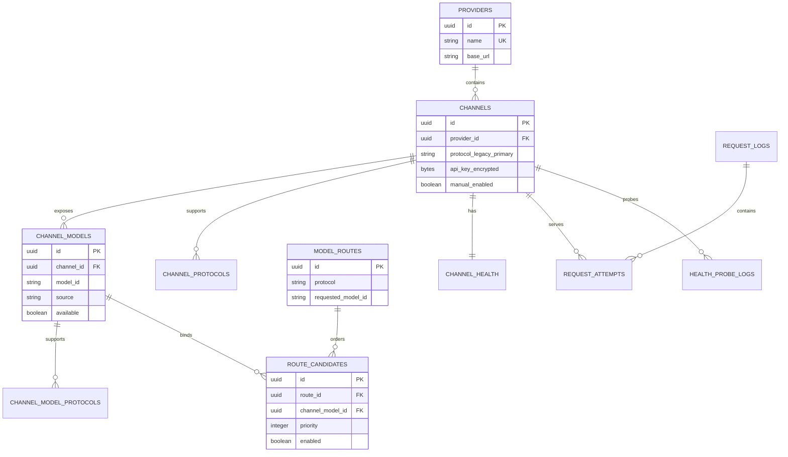

# 数据模型

状态：设计基线  
更新日期：2026-07-21

## 1. 设计原则

- SQLite 作为唯一持久化存储，启用 WAL 和外键约束。
- 主键使用 UUID 字符串，时间统一存储为 UTC ISO 8601 或 UTC 时间戳。
- API Key 只保存密文。
- 请求日志与渠道尝试分表，支持一次请求对应多次故障转移。
- 原始 usage 可以保留，用户请求、响应和错误正文默认不落库。
- 数据库约束负责保证优先级唯一，服务层负责保证协议和模型 ID 一致。

## 2. 实体关系

## 3. 配置表

### 3.1 `providers`

| 字段 | 类型 | 约束 | 说明 |
| --- | --- | --- | --- |
| `id` | TEXT | PK | UUID |
| `name` | TEXT | NOT NULL, UNIQUE | 供应商显示名 |
| `base_url` | TEXT | NOT NULL | API 根地址，不包含密钥 |
| `created_at` | DATETIME | NOT NULL | 创建时间 |
| `updated_at` | DATETIME | NOT NULL | 更新时间 |

删除供应商时默认拒绝存在渠道的情况；管理端必须先显式删除渠道，避免误删日志关联。

### 3.2 `channels`

| 字段 | 类型 | 约束 | 说明 |
| --- | --- | --- | --- |
| `id` | TEXT | PK | UUID |
| `provider_id` | TEXT | FK, NOT NULL | 所属供应商 |
| `name` | TEXT | NOT NULL | 账号或渠道显示名 |
| `protocol` | TEXT | NOT NULL | 兼容旧数据的主协议；实际能力读取 `channel_protocols` |
| `api_key_encrypted` | BLOB | NOT NULL | 加密后的 API Key |
| `api_key_hint` | TEXT | NOT NULL | 仅用于界面识别的末尾掩码 |
| `manual_enabled` | BOOLEAN | NOT NULL | 用户是否启用 |
| `health_check_model_id` | TEXT | NULL | 指定探测模型 |
| `created_at` | DATETIME | NOT NULL | 创建时间 |
| `updated_at` | DATETIME | NOT NULL | 更新时间 |

唯一约束：`UNIQUE(provider_id, name)`。

### 3.2.1 `channel_protocols`

以 `(channel_id, protocol)` 为复合主键，记录一个账号支持的全部请求格式。旧版 `channels.protocol` 在迁移时自动回填为第一条绑定。

### 3.3 `channel_models`

| 字段 | 类型 | 约束 | 说明 |
| --- | --- | --- | --- |
| `id` | TEXT | PK | UUID |
| `channel_id` | TEXT | FK, NOT NULL | 所属渠道 |
| `model_id` | TEXT | NOT NULL | 上游原始模型 ID |
| `display_name` | TEXT | NULL | 上游显示名 |
| `source` | TEXT | NOT NULL | `discovered` 或 `manual` |
| `available` | BOOLEAN | NOT NULL | 最近一次探测是否可见 |
| `metadata_json` | JSON/TEXT | NULL | 探测返回的非敏感元数据 |
| `first_seen_at` | DATETIME | NOT NULL | 首次发现时间 |
| `last_seen_at` | DATETIME | NULL | 最近探测可见时间 |
| `created_at` | DATETIME | NOT NULL | 创建时间 |
| `updated_at` | DATETIME | NOT NULL | 更新时间 |

唯一约束：`UNIQUE(channel_id, model_id)`。

### 3.3.1 `channel_model_protocols`

以 `(channel_model_id, protocol)` 为复合主键，记录探测或手动确认的模型协议能力。路由候选校验使用此表，而不是渠道主协议。

### 3.4 `model_routes`

| 字段 | 类型 | 约束 | 说明 |
| --- | --- | --- | --- |
| `id` | TEXT | PK | UUID |
| `protocol` | TEXT | NOT NULL | 路由协议 |
| `requested_model_id` | TEXT | NOT NULL | 客户端请求中的原始模型 ID |
| `enabled` | BOOLEAN | NOT NULL | 路由总开关 |
| `created_at` | DATETIME | NOT NULL | 创建时间 |
| `updated_at` | DATETIME | NOT NULL | 更新时间 |

唯一约束：`UNIQUE(protocol, requested_model_id)`。

这是代理执行层的内部分池表。管理 API 和前端按 `requested_model_id` 将多个协议行合并为一个逻辑模型路由。

### 3.5 `route_candidates`

| 字段 | 类型 | 约束 | 说明 |
| --- | --- | --- | --- |
| `id` | TEXT | PK | UUID |
| `route_id` | TEXT | FK, NOT NULL | 所属模型路由 |
| `channel_model_id` | TEXT | FK, NOT NULL | 渠道模型 |
| `priority` | INTEGER | NOT NULL, CHECK >= 0 | 数字越小优先级越高 |
| `enabled` | BOOLEAN | NOT NULL | 候选开关 |
| `created_at` | DATETIME | NOT NULL | 创建时间 |
| `updated_at` | DATETIME | NOT NULL | 更新时间 |

唯一约束：

- `UNIQUE(route_id, channel_model_id)`
- `UNIQUE(route_id, priority)`

服务层按模型 ID 接收一份全局渠道优先级，再将每个渠道写入其支持的内部协议路由；同一渠道在各协议路由中保持相同优先级。`channel_models.model_id` 必须等于 `model_routes.requested_model_id`。

### 3.6 `model_caps` 与 `capability_profiles`

#### 3.6.1 `capability_profiles`（能力档案）

| 字段 | 类型 | 约束 | 说明 |
| --- | --- | --- | --- |
| `id` | TEXT | PK | UUID |
| `name` | TEXT | UNIQUE, NOT NULL | 档案名称，如「GPT-5.6 系列」 |
| `description` | TEXT | NULL | 描述 |
| `context_window` | INTEGER | NULL | 上下文 Token |
| `max_tokens` | INTEGER | NULL | 最大输出 Token |
| `supports_image_input` | BOOLEAN | NULL | 图像输入 |
| `reasoning` | BOOLEAN | NULL | 思考能力 |
| `thinking_level_map` | JSON | NULL | 思考档位映射 |
| `created_at` | DATETIME | NOT NULL | 创建时间 |
| `updated_at` | DATETIME | NOT NULL | 更新时间 |

档案只收集功能能力字段，不包含成本：成本属于定价、随模型而异，仍在 `model_caps` 上按模型配置。

#### 3.6.2 `model_caps`

在既有能力字段（`context_window`、`max_tokens`、`supports_image_input`、`reasoning`、`thinking_level_map`、`cost_input`、`cost_output`、`cost_cache_read`、`cost_cache_write`、`source`）之外，新增：

| 字段 | 类型 | 约束 | 说明 |
| --- | --- | --- | --- |
| `profile_id` | TEXT | FK `capability_profiles.id` ON DELETE SET NULL | 引用的能力档案；为空表示未绑定 |

行为约定：

- 应用档案：`PUT /model-capabilities/{model_id}` 携带 `profile_id` 时，档案能力字段回填到模型行并建立引用；请求中显式给出的字段覆盖档案值。
- 档案更新：`PUT /capability-profiles/{id}` 会把能力字段同步到所有引用该档案的 `model_caps` 行（成本与 `profile_id` 不变）。
- 档案删除：引用模型解除绑定（`profile_id` 置空），已应用的能力值保留。
- 手动保存不带 `profile_id` 的完整替换，或切换 `source=auto`，都会解除绑定。

## 4. 健康状态表

### 4.1 `channel_health`

| 字段 | 类型 | 约束 | 说明 |
| --- | --- | --- | --- |
| `channel_id` | TEXT | PK, FK | 一对一关联渠道 |
| `state` | TEXT | NOT NULL | `active`、`open`、`probing` |
| `consecutive_failures` | INTEGER | NOT NULL | 连续可计数失败数 |
| `disabled_until` | DATETIME | NULL | 自动熔断截止时间 |
| `probe_lease_until` | DATETIME | NULL | 探测抢占租约截止时间 |
| `last_success_at` | DATETIME | NULL | 最近普通请求成功时间 |
| `last_failure_at` | DATETIME | NULL | 最近可计数失败时间 |
| `last_error_kind` | TEXT | NULL | 脱敏后的错误分类 |
| `last_status_code` | INTEGER | NULL | 最近上游状态码 |
| `updated_at` | DATETIME | NOT NULL | 更新时间及乐观并发依据 |

手动禁用不进入该状态机，统一读取 `channels.manual_enabled`。这样自动任务无法意外恢复用户手动关闭的渠道。

### 4.2 `health_probe_logs`

| 字段 | 类型 | 说明 |
| --- | --- | --- |
| `id` | TEXT PK | UUID |
| `channel_id` | TEXT FK | 被探测渠道 |
| `model_id` | TEXT | 探测模型 |
| `started_at` | DATETIME | 开始时间 |
| `duration_ms` | INTEGER NULL | 探测耗时 |
| `success` | BOOLEAN | 是否通过 |
| `status_code` | INTEGER NULL | 上游状态码 |
| `error_kind` | TEXT NULL | 脱敏错误分类 |
| `next_probe_at` | DATETIME NULL | 失败后的下次时间 |

健康探测日志不保存正文，不并入普通请求统计。

## 5. 请求与尝试日志

### 5.1 `request_logs`

| 字段 | 类型 | 说明 |
| --- | --- | --- |
| `id` | TEXT PK | 网关请求 ID |
| `protocol` | TEXT | 入站协议 |
| `model_id` | TEXT NULL | 请求模型，解析失败时为空 |
| `endpoint` | TEXT | 规范化入口名称，不含敏感查询参数 |
| `stream` | BOOLEAN NULL | 是否为流式请求 |
| `started_at` | DATETIME | 接收时间 |
| `finished_at` | DATETIME NULL | 完成时间 |
| `total_duration_ms` | INTEGER NULL | 总耗时 |
| `final_status_code` | INTEGER NULL | 客户端收到的状态码 |
| `outcome` | TEXT | `success`、`upstream_error`、`gateway_error`、`cancelled` |
| `attempt_count` | INTEGER | 渠道尝试次数 |
| `final_channel_id` | TEXT FK NULL | 最终返回渠道 |
| `request_bytes` | INTEGER NULL | 请求体字节数 |
| `response_bytes` | INTEGER NULL | 向客户端写出的响应字节数 |
| `created_at` | DATETIME | 记录时间 |

建议索引：

- `(started_at DESC)`
- `(protocol, model_id, started_at DESC)`
- `(outcome, started_at DESC)`
- `(final_channel_id, started_at DESC)`

### 5.2 `request_attempts`

| 字段 | 类型 | 说明 |
| --- | --- | --- |
| `id` | TEXT PK | UUID |
| `request_id` | TEXT FK | 所属客户端请求 |
| `channel_id` | TEXT FK | 尝试渠道 |
| `attempt_no` | INTEGER | 从 1 开始的尝试顺序 |
| `priority_snapshot` | INTEGER | 请求开始时的优先级 |
| `started_at` | DATETIME | 上游尝试开始时间 |
| `finished_at` | DATETIME NULL | 尝试结束时间 |
| `status_code` | INTEGER NULL | 上游 HTTP 状态码 |
| `outcome` | TEXT | `success`、`http_error`、`transport_error`、`cancelled`、`stream_interrupted` |
| `error_kind` | TEXT NULL | 标准化错误分类 |
| `failover_eligible` | BOOLEAN | 当时是否允许切换 |
| `response_started` | BOOLEAN | 是否已向客户端开始响应 |
| `first_byte_ms` | INTEGER NULL | 上游首字节延迟 |
| `first_token_ms` | INTEGER NULL | 首内容 Token 延迟 |
| `duration_ms` | INTEGER NULL | 本次尝试总耗时 |
| `input_tokens` | INTEGER NULL | 上游报告的总输入 Token |
| `cache_read_tokens` | INTEGER NULL | 缓存读取 Token |
| `cache_write_tokens` | INTEGER NULL | 缓存写入 Token |
| `cache_miss_input_tokens` | INTEGER NULL | 归一化非缓存输入 Token |
| `output_tokens` | INTEGER NULL | 输出 Token |
| `tps` | REAL NULL | 输出 TPS |
| `raw_usage_json` | JSON/TEXT NULL | 脱敏后的上游原始 usage |
| `response_bytes` | INTEGER NULL | 上游响应字节数 |
| `created_at` | DATETIME | 记录时间 |

唯一约束：`UNIQUE(request_id, attempt_no)`。

所有 Token 字段允许 `NULL`。`0` 只表示上游明确报告为零，不能表示未知。

## 6. 设置与任务表

### 6.1 `settings`

| 字段 | 类型 | 说明 |
| --- | --- | --- |
| `key` | TEXT PK | 设置键 |
| `value_json` | JSON/TEXT | 类型化设置值 |
| `updated_at` | DATETIME | 更新时间 |

可管理设置包括局域网信任开关、加密保存的管理/代理访问密钥、失败阈值、熔断秒数、最大尝试次数、各类超时、模型探测周期、日志保留时间和请求体大小限制。启动端口、监听地址、数据库路径和主密钥路径只允许通过启动配置设置。

### 6.2 `discovery_runs`

| 字段 | 类型 | 说明 |
| --- | --- | --- |
| `id` | TEXT PK | UUID |
| `channel_id` | TEXT FK | 探测渠道 |
| `trigger` | TEXT | `manual` 或 `scheduled` |
| `started_at` | DATETIME | 开始时间 |
| `finished_at` | DATETIME NULL | 完成时间 |
| `success` | BOOLEAN NULL | 是否成功 |
| `model_count` | INTEGER NULL | 返回模型数量 |
| `status_code` | INTEGER NULL | 上游状态码 |
| `error_kind` | TEXT NULL | 脱敏错误分类 |

## 7. 删除与保留策略

- 请求日志到期时先删除 `request_attempts`，再删除 `request_logs`，使用外键级联完成。
- 健康探测和发现任务日志采用同一保留周期。
- 删除渠道前，如果它仍属于路由候选，管理 API 返回 `409` 并列出关联数量。
- 删除渠道后历史请求日志中的 `channel_id` 使用 `ON DELETE SET NULL`，同时保留渠道名称快照字段作为后续迁移选项。
- 删除供应商前必须先删除其渠道。
- 数据库维护任务定期执行批量删除和增量 checkpoint，不在请求热路径执行 `VACUUM`。

## 8. 迁移策略

- Alembic 迁移文件纳入版本控制。
- 启动时检查版本，开发模式可自动升级，正式运行脚本显式执行升级。
- 破坏性迁移前自动备份 SQLite 文件。
- 业务代码只依赖当前 schema，不在运行时动态创建缺失列。
